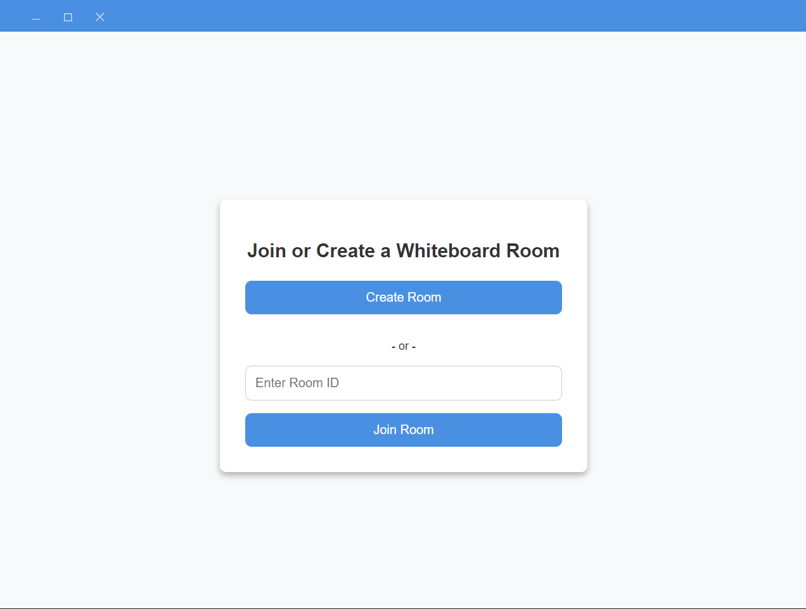
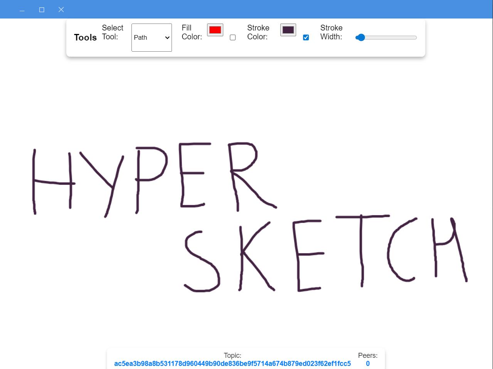

# **HyperSketch** 🖌️✨  
**A Peer-to-Peer (P2P) Collaborative Whiteboard for Real-Time Brainstorming**  

 

### **🚀 Overview**  
HyperSketch is a **decentralized, peer-to-peer whiteboard** that enables real-time sketching and brainstorming **without relying on centralized servers**. Built for **designers, educators, and remote teams**, it offers a **low-latency, secure, and scalable** solution for collaborative creativity.  

🔹 **No central servers** – Direct peer-to-peer (P2P) connections  
🔹  real-time sync using PEARS stack  
🔹 **Simple drawing tools** for quick brainstorming sessions  

---  

## Screenshots

### Join Room

### Whiteboard

---

### **🛠️ Technologies Used**  
HyperSketch is powered by the **PEARS stack**, leveraging the latest advancements in **distributed systems**:  

- **Hypercore** – Append-only log for storing & syncing whiteboard changes.(not done)  
- **Hyperswarm** – Peer discovery for direct connections. (done) 
---  

### **🎨 Features (Current & Upcoming)**  
✅ **Real-time drawing sync** – Users can sketch on a shared board.  
✅ **P2P connectivity** – Connects directly to peers without servers.  
✅ **Simple & lightweight** – Minimal UI for quick collaboration.  

🛠 **Upcoming Features**  
- 🎨 **Advanced drawing tools** (shapes, text, layers)  
- 🔄 **Undo/Redo functionality**  
- 📁 **Save & Load whiteboards**  
- 🔒 **End-to-end encryption for private sessions**    
- 📡 **Multi-device persistent storage**  

---  

